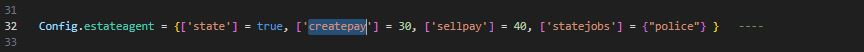

# 🖱 Commands

* Admins can make any person in the vehicle the owner of the vehicle.

```
/setvehownerplayer playerid
```

* Garage owners can invite their friends to use the garage.

```
/garageinvite [add,remove,list]
```


for /garageinvite remove  listid        >> you can find list id from /garageinvite list

/garageinvite add playerid    >> added player from serverid(like 1,2,3)


* With this command, admins can create a garage.(They need to give perm via config.)

```
/creategarage
```

* Create garage for Realstate jobs&#x20;

```
/crealstate
```

> createpay and sellpay are in the percentile.
>
> If Realstate builds a garage, they will give money with a 30% deduction. If one person buys it, 40% more will be refunded.

<figure><figcaption></figcaption></figure>

