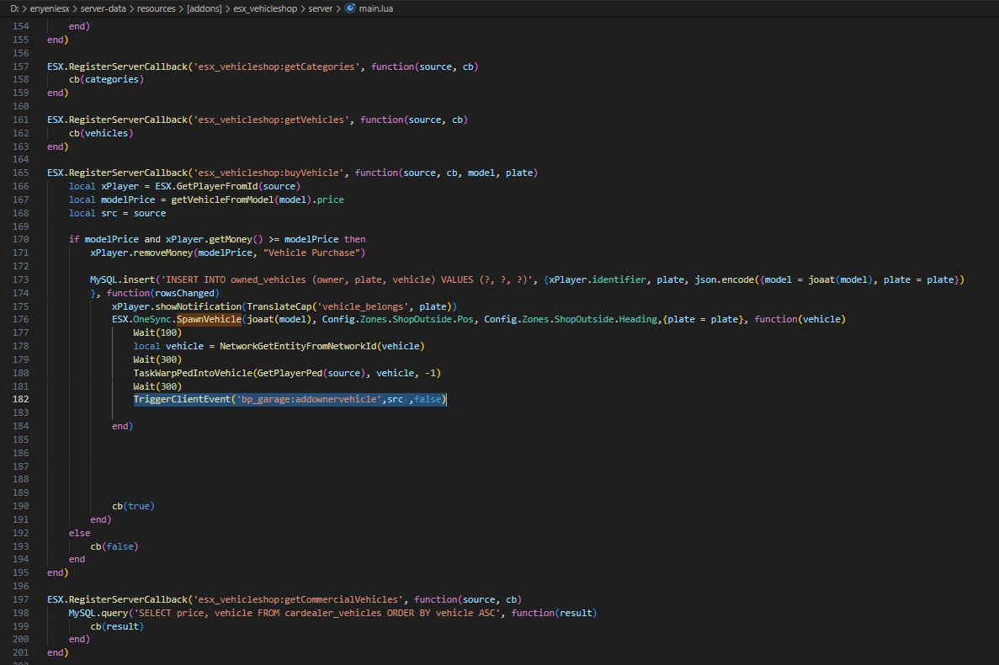
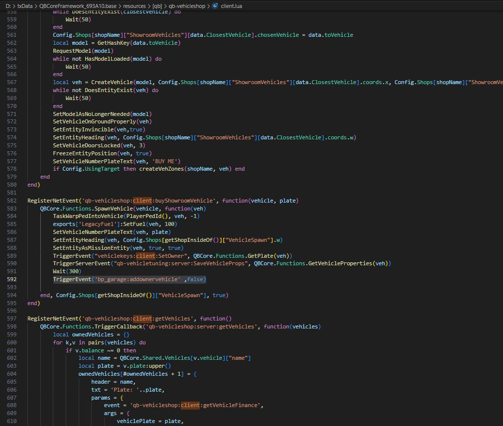
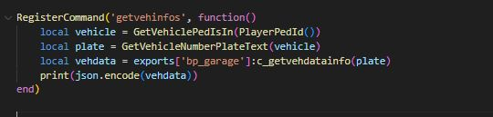
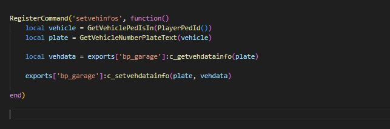
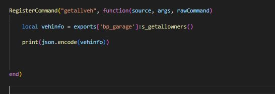
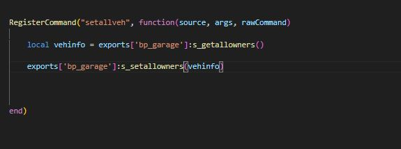
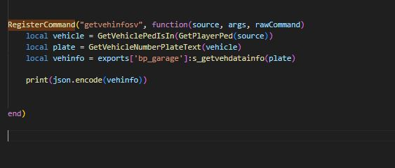
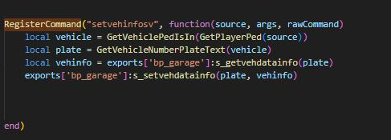

# ⚔ Export and Events

## **EVENTS INFO**

#### ADD NEW VEHICLE WITH INFO -- CLIENT

It allows you to add the new vehicle with its information on the client.

```lua
TriggerServerEvent('bp_garage:addvehiclefrominfo', plate,hash,model,impound,vehprops)
```

#### :tada: ADDOWNERPART -- SERVER

This is how it is used on the server side. **( src = playerid , false = impound state)**

:warning: **IMPORTANT  **<mark style="color:purple;">**This event runs while the player is**</mark>** **<mark style="color:red;">**in the vehicle**</mark><mark style="color:purple;">**.**</mark>

```lua
TriggerClientEvent('bp_garage:addownervehicle',src ,false)
```

#### :tada: ADDOWNERPART -- CLIENT

This is how it is used on the client side. **(  false = impound state)**

```lua
TriggerEvent('bp_garage:addownervehicle' ,false)
```

#### :tada: ADDOWNERPART -- ESX\_VEHICLESHOP EXAMPLE&#x20;

**IN ESX\_VEHICLESHOP > **<mark style="color:blue;">**SERVER.LUA**</mark>

<figure><figcaption></figcaption></figure>

#### ADDOWNERPART -- QB-VEHICLESHOP EXAMPLE&#x20;

**IN QB-VEHICLESHOP > CLIENT**<mark style="color:blue;">**.LUA**</mark>

<figure><figcaption></figcaption></figure>

## **EXPORTS INFO**

#### CLIENT PARTS --

```lua
exports['bp_garage']:c_getvehdatainfo(plate)
```

<div align="left">

<figure><figcaption><p>RETURN BACK </p></figcaption></figure>

</div>


```
{"garageid":"none","model":"BLISTA","impoundcost":500,"impoundvehdata":{"modSmokeEnabled"
:false,"bodyHealth":1000.0,"doorsBroken":{"4":false,"3":false,"0":false,"2":false,"1":false},"modTrunk":-1,"modSeats":-1,"modAirFilter":-1,"xenonColor":255,"modTrimA":-1,"modDoorR":-1,"modAerials":-1,"modHood":-1,"tyreSmokeColor":[255,255,255],"plateIndex":0,"modSuspension":-1,"wheelColor":156,"modXenon":false,"modTrimB":-1,"modArmor":-1,"modFender":-1,"modArchCover":-1,"modFrontWheels":-1,"extras":{"10":false,"12":1},"modLightbar":-1,"dashboardColor":0,"modTurbo":false,"modSideSkirt":-1,"windowsBroken":{"4":true,"3":false,"6":false,"5":true,"0":false,"7":false,"2":false,"1":false},"modGrille":-1,"modRoof":-1,"modDoorSpeaker":-1,"tankHealth":1000.0,"engineHealth":1000.0,"modShifterLeavers":-1,"modAPlate":-1,"plate":"RFZ 704","modFrontBumper":-1,"modBrakes":-1,"color2":0,"modDial":-1,"modDashboard":-1,"modSpoilers":-1,"modHorns":-1,"modRearBumper":-1,"modHydrolic":-1,"modFrame":-1,"modEngine":-1,"modOrnaments":-1,"interiorColor":0,"wheels":0,"neonColor":[255,0,255],"modTransmission":-1,"modSpeakers":-1,"windowTint":-1,"pearlescentColor":111,"modStruts":-1,"fuelLevel":65.0,"modLivery":-1,"modTank":-1,"modEngineBlock":-1,"model":-344943009,"modExhaust":-1,"modPlateHolder":-1,"dirtLevel":3.0,"modBackWheels":-1,"modSteeringWheel":-1,"tyreBurst":{"4":false,"5":false,"0":false,"1":false},"modVanityPlate":-1,"modRightFender":-1,"color1":6,"neonEnabled":[false,false,false,false]},"ownerid":"char1:1bf0cb75aed4b1b83abda5c1e679e1bdd6a2bfe6","plate":"RFZ 704","impound":true}
```


```lua
exports['bp_garage']:c_setvehdatainfo(plate, data)
```

<div align="left">

<figure><figcaption><p><mark style="color:red;"><strong>Here you can make changes to the data and save it.</strong></mark></p></figcaption></figure>

</div>

#### SERVER PARTS --

#### Get All vehicle Infos

```lua
exports['bp_garage']:s_getallowners()
```

```
//[{"plate":"JVV 558","impound":false,"ownerid":"char1:1bf0cb75aed4b1b83abda5c1e679e1bdd6a2bfe6","impoundvehdata":{"modSteeringWheel":-1,"modSpoilers":-1,"modExhaust":-1,"modLightbar":-1,"modShifterLeavers":-1,"fuelLevel":65.0,"modRearBumper":-1,"modEngine":-1,"xenonColor":255,"bodyHealth":1000.0,"modXenon":false,"modSmokeEnabled":1,"plate":"JVV 558","modFender":-1,"modAPlate":-1,"modDashboard":-1,"modPlateHolder":-1,"modTransmission":-1,"windowsBroken":{"2":false,"3":false,"0":false,"1":false,"6":false,"7":false,"4":true,"5":true},"modEngineBlock":-1,"tyreSmokeColor":[255,255,255],"modSideSkirt":-1,"modBackWheels":-1,"modStruts":-1,"doorsBroken":{"2":false,"3":false,"0":false,"1":false,"4":false},"engineHealth":1000.0,"dirtLevel":6.0,"color1":50,"interiorColor":111,"modTank":-1,"modHorns":-1,"wheels":5,"modSeats":-1,"extras":[],"tankHealth":1000.0,"modFrontBumper":-1,"neonEnabled":[false,false,false,false],"modFrontWheels":-1,"modSuspension":-1,"modAerials":-1,"dashboardColor":111,"neonColor":[255,0,255],"modOrnaments":-1,"modVanityPlate":-1,"model":1549126457,"modSpeakers":-1,"modTrunk":-1,"wheelColor":92,"modRightFender":-1,"modHydrolic":-1,"modTrimB":-1,"modArchCover":-1,"modLivery":-1,"modDoorSpeaker":-1,"modFrame":-1,"modGrille":-1,"color2":0,"pearlescentColor":55,"modAirFilter":-1,"modDial":-1,"windowTint":-1,"modBrakes":-1,"plateIndex":0,"modRoof":-1,"modTrimA":-1,"modDoorR":-1,"modArmor":-1,"modHood":-1,"tyreBurst":{"5":false,"0":false,"4":false,"1":false},"modTurbo":false},"impoundcost":500,"model":1549126457,"garageid":"centerpark"},{"plate":"DENEMEBU","impound":false,"ownerid":"char1:1bf0cb75aed4b1b83abda5c1e679e1bdd6a2bfe6","impoundvehdata":{"modSteeringWheel":-1,"modSpoilers":2,"modExhaust":3,"modLightbar":-1,"modShifterLeavers":-1,"modDoorR":-1,"modRearBumper":-1,"modEngine":-1,"xenonColor":255,"bodyHealth":997.3,"modRightFender":-1,"modHood":0,"plate":"DENEMEBU","modFender":-1,"modAPlate":-1,"modDashboard":-1,"modPlateHolder":-1,"modTransmission":-1,"windowsBroken":{"2":false,"3":false,"0":false,"1":false,"6":false,"7":false,"4":true,"5":true},"modEngineBlock":-1,"plateIndex":0,"modSideSkirt":-1,"modBackWheels":-1,"modStruts":-1,"doorsBroken":{"2":false,"3":false,"0":false,"1":false,"4":false},"engineHealth":995.9,"dirtLevel":9.0,"color1":89,"modArchCover":-1,"neonColor":[255,0,255],"modTurbo":false,"wheels":0,"modSeats":-1,"extras":{"10":false,"11":false},"tankHealth":999.7,"modFrontBumper":-1,"neonEnabled":[false,false,false,false],"modFrontWheels":-1,"modSuspension":-1,"modAerials":-1,"modTrimA":-1,"modHorns":-1,"pearlescentColor":7,"modOrnaments":-1,"model":-1122289213,"modSpeakers":-1,"modXenon":false,"modVanityPlate":-1,"tyreBurst":{"5":false,"0":false,"4":false,"1":false},"dashboardColor":0,"modHydrolic":-1,"fuelLevel":65.0,"modLivery":-1,"modDoorSpeaker":-1,"modTrimB":-1,"modFrame":0,"color2":89,"modGrille":-1,"modSmokeEnabled":1,"modDial":-1,"windowTint":-1,"modBrakes":-1,"tyreSmokeColor":[255,255,255],"modRoof":0,"modTrunk":-1,"wheelColor":156,"modArmor":-1,"modAirFilter":-1,"modTank":-1,"interiorColor":0},"impoundcost":0,"model":"ZION","garageid":137}]
```

<div align="left">

<figure><figcaption></figcaption></figure>

</div>

#### Set All vehicle infos

```lua
exports['bp_garage']:s_setallowners(data)
```

<div align="left">

<figure><figcaption></figcaption></figure>

</div>

#### Get vehicle info from plate

<pre class="language-lua"><code class="lang-lua"><strong>exports['bp_garage']:s_getvehdatainfo(plate)
</strong></code></pre>

<div align="left">

<figure><figcaption></figcaption></figure>

</div>

#### Set vehicle info from plate

```lua
exports['bp_garage']:s_setvehdatainfo(plate, vehinfo)
```

<div align="left">

<figure><figcaption></figcaption></figure>

</div>

**The following export pulls all vehicles with information.**

```lua
exports['bp_garage']:s_getplayerallveh()
```
