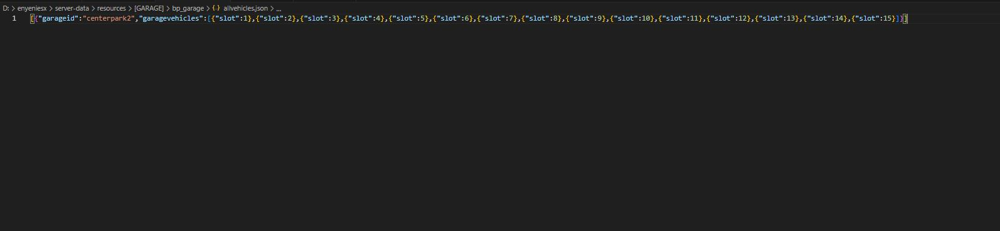
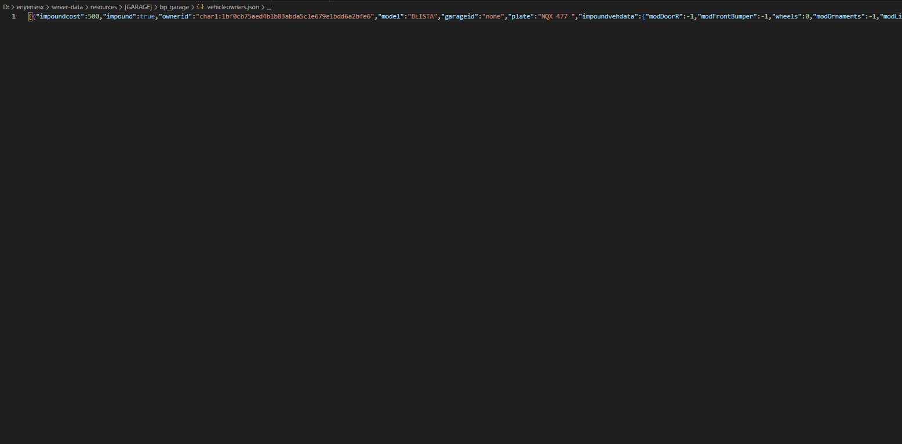
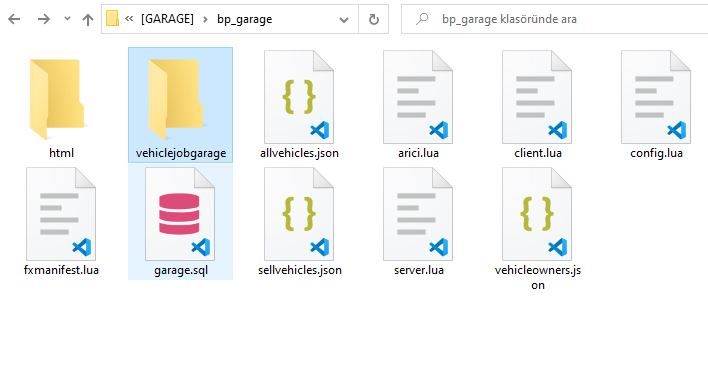

# ❓ What is JSON files

### ALLVEHICLE.JSON FILE

**This file saves the vehicles in the **<mark style="color:purple;">**config.allgarages**</mark>** section that you set from the config as slots.**  **If you want to **<mark style="color:orange;">**reset**</mark>** it, delete it for the json file and write **<mark style="color:blue;">**\[]**</mark>** this.**

<figure><figcaption></figcaption></figure>

<figure><figcaption></figcaption></figure>

### WEHICLEOWNERS.JSON FILE

**All vehicle owners register here. Vehicle impound transactions are also processed here. Again, you can delete it and type **<mark style="color:orange;">**\[]**</mark>** to reset it.**

<figure><figcaption></figcaption></figure>

### SELLVEHICLES.JSON FILE

**All used second-hand vehicles are listed here.**

### VEHICLEJOBGARAGE FILE

<figure><figcaption></figcaption></figure>

**Job json files are recorded in this. Vehicles are registered with their props.**
